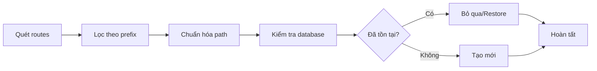

<div align="center">

# 🔐 Routes Scan to Permission Command

### Hướng dẫn tự động quét và đồng bộ Routes sang Permissions

[](https://laravel.com/)
[](https://laravel.com/docs/8.x/artisan)
[](https://www.mysql.com/)

</div>

---

## 📋 Mục lục

- [Tổng quan](#-tổng-quan)
- [Cách sử dụng](#-cách-sử-dụng)
- [Các tùy chọn](#-các-tùy-chọn)
- [Cách hoạt động](#-cách-hoạt-động)
- [Ví dụ thực tế](#-ví-dụ-thực-tế)
- [Tích hợp Workflow](#-tích-hợp-workflow)
- [Xử lý sự cố](#-xử-lý-sự-cố)
- [Best Practices](#-best-practices)

---

## 🎯 Tổng quan

Command `routes:scan` được sử dụng để **tự động quét tất cả các routes** trong ứng dụng và thêm vào bảng `permissions`. 

**Lợi ích:**
- ✅ Tự động hóa việc quản lý permissions
- ✅ Đồng bộ routes mới với hệ thống phân quyền
- ✅ Giảm thiểu lỗi thủ công
- ✅ Hỗ trợ soft delete và restore

**Use case:**
- Sau khi thêm routes API mới
- Khi setup project lần đầu
- Trong CI/CD pipeline
- Khi cần đồng bộ lại toàn bộ permissions

---

## 💻 Cách sử dụng

### 1️⃣ Quét routes cơ bản

Quét tất cả routes có prefix `api` (mặc định):

```bash
php artisan routes:scan
```

<details>
<summary>Output mẫu</summary>

```
Bắt đầu quét routes với prefix: /api
  + Added: POST /api/auth/register
  + Added: POST /api/auth/login
  + Added: GET /api/users
  ...
Hoàn thành quét routes!
```

</details>

---

### 2️⃣ Quét routes với prefix tùy chỉnh

Quét routes với prefix khác:

```bash
php artisan routes:scan --prefix=admin
```

> **📝 Ghi chú:** Hữu ích khi bạn có nhiều nhóm routes khác nhau (admin, api, web, v.v.)

---

### 3️⃣ Quét routes và xóa permissions cũ

Sử dụng option `--force` để xóa tất cả permissions cũ trước khi quét:

```bash
php artisan routes:scan --force
```

> **⚠️ Cảnh báo:** Option này sẽ xóa toàn bộ permissions cũ. Nên backup database trước khi chạy!

---

### 4️⃣ Hiển thị chi tiết

Sử dụng option `-v` hoặc `--verbose` để hiển thị tất cả routes (kể cả đã tồn tại):

```bash
php artisan routes:scan -v
```

---

## ⚙️ Các tùy chọn

| Option | Kiểu | Mô tả | Giá trị mặc định |
|--------|------|-------|------------------|
| `--prefix` | string | Chỉ quét routes có prefix này | `api` |
| `--force` | flag | Xóa tất cả permissions cũ trước khi quét | `false` |
| `-v, --verbose` | flag | Hiển thị chi tiết tất cả routes | `false` |

### Kết hợp nhiều options

```bash
# Quét admin routes và hiển thị chi tiết
php artisan routes:scan --prefix=admin -v

# Reset toàn bộ và quét lại với verbose
php artisan routes:scan --force -v
```

---

## 🔍 Cách hoạt động

### Quy trình xử lý



---

### Bước 1: Quét routes

Command sẽ quét tất cả routes đã đăng ký trong ứng dụng

```php
Route::getRoutes()->getRoutes()
```

---

### Bước 2: Lọc theo prefix

Chỉ lấy các routes có prefix được chỉ định (mặc định là `api`)

**Ví dụ:**
```
✅ /api/users
✅ /api/courses
❌ /admin/dashboard (không có prefix api)
❌ /web/home (không có prefix api)
```

---

### Bước 3: Chuẩn hóa path

Tất cả route parameters sẽ được chuẩn hóa thành `{id}`:

| Route gốc | Route chuẩn hóa |
|-----------|-----------------|
| `/api/users/{userId}` | `/api/users/{id}` |
| `/api/courses/{courseId}` | `/api/courses/{id}` |
| `/api/lessons/{lessonId}` | `/api/lessons/{id}` |
| `/api/users/{userId}/courses/{courseId}` | `/api/users/{id}/courses/{id}` |

> **💡 Lý do:** Giúp nhóm các permission cho cùng một resource lại với nhau.

---

### Bước 4: Lưu vào database

**Logic xử lý:**

```php
// Nếu permission chưa tồn tại → Tạo mới
if (!exists) {
    Permission::create([...]);
}

// Nếu permission đã tồn tại → Bỏ qua
if (exists && !deleted) {
    skip();
}

// Nếu permission bị soft delete → Restore
if (exists && deleted) {
    Permission::withTrashed()->restore();
}
```

---

## 📊 Ví dụ thực tế

### Ví dụ 1: Quét routes API lần đầu

```bash
php artisan routes:scan
```

**Output:**

```
Bắt đầu quét routes với prefix: /api
  + Added: POST /api/auth/register
  + Added: POST /api/auth/login
  + Added: POST /api/auth/refresh
  + Added: POST /api/auth/logout
  + Added: GET /api/auth/me
  + Added: GET /api/users
  + Added: POST /api/users
  + Added: GET /api/users/{id}
  + Added: PUT /api/users/{id}
  + Added: DELETE /api/users/{id}
  + Added: GET /api/courses
  + Added: POST /api/courses
  + Added: GET /api/courses/{id}
  + Added: PUT /api/courses/{id}
  + Added: DELETE /api/courses/{id}

Hoàn thành quét routes!
┌─────────────┬──────────┐
│ Thao tác    │ Số lượng │
├─────────────┼──────────┤
│ Đã thêm     │ 36       │
│ Đã cập nhật │ 0        │
│ Đã bỏ qua   │ 0        │
│ Tổng cộng   │ 36       │
└─────────────┴──────────┘
Tổng số permissions trong database: 36
```

---

### Ví dụ 2: Quét lại routes (đã tồn tại)

```bash
php artisan routes:scan
```

**Output:**

```
Bắt đầu quét routes với prefix: /api
  - Skipped: POST /api/auth/register (đã tồn tại)
  - Skipped: POST /api/auth/login (đã tồn tại)
  - Skipped: POST /api/auth/refresh (đã tồn tại)
  ...

Hoàn thành quét routes!
┌─────────────┬──────────┐
│ Thao tác    │ Số lượng │
├─────────────┼──────────┤
│ Đã thêm     │ 0        │
│ Đã cập nhật │ 0        │
│ Đã bỏ qua   │ 36       │
│ Tổng cộng   │ 36       │
└─────────────┴──────────┘
Tổng số permissions trong database: 36
```

---

### Ví dụ 3: Reset và quét lại

```bash
php artisan routes:scan --force
```

**Output:**

```
Bắt đầu quét routes với prefix: /api
Đang xóa tất cả permissions cũ...
Đã xóa tất cả permissions cũ.
  + Added: POST /api/auth/register
  + Added: POST /api/auth/login
  + Added: POST /api/auth/refresh
  ...

Hoàn thành quét routes!
┌─────────────┬──────────┐
│ Thao tác    │ Số lượng │
├─────────────┼──────────┤
│ Đã thêm     │ 36       │
│ Đã cập nhật │ 0        │
│ Đã bỏ qua   │ 0        │
│ Tổng cộng   │ 36       │
└─────────────┴──────────┘
Tổng số permissions trong database: 36
```

---

### Ví dụ 4: Quét routes admin

```bash
php artisan routes:scan --prefix=admin -v
```

**Output:**

```
Bắt đầu quét routes với prefix: /admin
  + Added: GET /admin/dashboard
  + Added: GET /admin/users
  + Added: POST /admin/users
  ...

Hoàn thành quét routes!
┌─────────────┬──────────┐
│ Thao tác    │ Số lượng │
├─────────────┼──────────┤
│ Đã thêm     │ 15       │
│ Đã cập nhật │ 0        │
│ Đã bỏ qua   │ 0        │
│ Tổng cộng   │ 15       │
└─────────────┴──────────┘
Tổng số permissions trong database: 51
```

---

## 🔄 Tích hợp Workflow

### 1️⃣ Sau khi thêm routes mới

Sau khi thêm routes mới vào `routes/api.php`, chạy command để cập nhật permissions:

```bash
# File: routes/api.php
Route::prefix('api')->group(function () {
    // Routes mới
    Route::get('/lessons', [LessonController::class, 'index']);
    Route::post('/lessons', [LessonController::class, 'store']);
});
```

```bash
# Quét để thêm permissions mới
php artisan routes:scan
```

---

### 2️⃣ Trong CI/CD Pipeline

Thêm vào GitHub Actions workflow:

```yaml
# .github/workflows/deploy.yml
name: Deploy

on:
  push:
    branches: [ main ]

jobs:
  deploy:
    runs-on: ubuntu-latest
    steps:
      - uses: actions/checkout@v2
      
      - name: Install Dependencies
        run: composer install
      
      - name: Run Migrations
        run: php artisan migrate
      
      - name: Scan Routes to Permissions
        run: php artisan routes:scan
      
      - name: Cache Config
        run: php artisan config:cache
```

---

### 3️⃣ Trong Deployment Script

Thêm vào deployment script:

```bash
#!/bin/bash
# File: deploy.sh

echo "🚀 Starting deployment..."

# Pull latest code
git pull origin main

# Install dependencies
composer install --no-dev --optimize-autoloader

# Run migrations
php artisan migrate --force

# Scan routes to permissions
php artisan routes:scan

# Optimize
php artisan config:cache
php artisan route:cache
php artisan view:cache

echo "✅ Deployment completed!"
```

Chạy deployment:

```bash
chmod +x deploy.sh
./deploy.sh
```

---

### 4️⃣ Trong Laravel Scheduler (Tùy chọn)

Nếu muốn tự động quét định kỳ:

```php
// File: app/Console/Kernel.php

protected function schedule(Schedule $schedule)
{
    // Quét routes mỗi ngày lúc 2 giờ sáng
    $schedule->command('routes:scan')
             ->daily()
             ->at('02:00');
}
```

---

## 🔧 Xử lý sự cố

<details>
<summary><strong>❌ Lỗi: Không quét được routes</strong></summary>

**Triệu chứng:**
```
Hoàn thành quét routes!
┌─────────────┬──────────┐
│ Thao tác    │ Số lượng │
├─────────────┼──────────┤
│ Đã thêm     │ 0        │
│ Tổng cộng   │ 0        │
└─────────────┴──────────┘
```

**Nguyên nhân & Giải pháp:**

1. **Routes chưa được đăng ký**
   ```bash
   # Kiểm tra danh sách routes
   php artisan route:list
   ```

2. **Prefix không đúng**
   ```bash
   # Thử với prefix khác
   php artisan routes:scan --prefix=admin
   ```

3. **RouteServiceProvider chưa load routes**
   ```php
   // File: app/Providers/RouteServiceProvider.php
   public function boot()
   {
       $this->routes(function () {
           Route::prefix('api')
               ->middleware('api')
               ->group(base_path('routes/api.php'));
       });
   }
   ```

</details>

<details>
<summary><strong>❌ Lỗi: Permissions không được tạo</strong></summary>

**Kiểm tra:**

```bash
# 1. Kiểm tra migration đã chạy chưa
php artisan migrate:status

# 2. Kiểm tra bảng permissions tồn tại
php artisan tinker
>>> \DB::select('SHOW TABLES LIKE "permissions"');

# 3. Kiểm tra logs
tail -f storage/logs/laravel.log
```

**Giải pháp:**

```bash
# Chạy lại migrations
php artisan migrate

# Nếu vẫn lỗi, rollback và migrate lại
php artisan migrate:rollback
php artisan migrate
```

</details>

<details>
<summary><strong>❌ Lỗi: Duplicate permissions</strong></summary>

**Triệu chứng:**
```
SQLSTATE[23000]: Integrity constraint violation: 
1062 Duplicate entry 'GET-/api/users' for key 'permissions_method_path_unique'
```

**Nguyên nhân:**
Bảng `permissions` có unique constraint trên `(method, path)`

**Giải pháp:**

```bash
# Option 1: Xóa và quét lại
php artisan routes:scan --force

# Option 2: Xóa thủ công duplicate
php artisan tinker
>>> Permission::where('method', 'GET')->where('path', '/api/users')->delete();
```

</details>

<details>
<summary><strong>⚠️ Cảnh báo: HTTP Methods không được quét</strong></summary>

**Lưu ý:** Command chỉ quét các methods sau:

- ✅ GET
- ✅ POST
- ✅ PUT
- ✅ DELETE
- ✅ PATCH
- ❌ OPTIONS (bỏ qua)
- ❌ HEAD (bỏ qua)

**Lý do:** OPTIONS và HEAD thường là auto-generated, không cần permission riêng.

</details>

---

## 💡 Best Practices

### 1. Chạy sau khi thêm routes mới

```bash
# Workflow đề xuất
git add routes/api.php
git commit -m "Add new lesson routes"
php artisan routes:scan
git add database/
git commit -m "Update permissions"
git push
```

---

### 2. Sử dụng --force cẩn thận

```bash
# ❌ Không nên: Chạy trực tiếp trên production
php artisan routes:scan --force

# ✅ Nên: Backup trước khi chạy
mysqldump -u root -p myapp permissions > permissions_backup.sql
php artisan routes:scan --force

# Hoặc sử dụng Laravel backup
php artisan backup:run --only-db
php artisan routes:scan --force
```

---

### 3. Kiểm tra kết quả

Luôn review output để đảm bảo routes được quét đúng:

```bash
# Chạy với verbose để xem chi tiết
php artisan routes:scan -v

# Kiểm tra database
php artisan tinker
>>> Permission::count();
>>> Permission::latest()->take(10)->get(['method', 'path']);
```

---

### 4. Tích hợp vào Git Hooks

Tạo pre-commit hook:

```bash
# File: .git/hooks/pre-commit
#!/bin/bash

# Kiểm tra nếu routes/api.php có thay đổi
if git diff --cached --name-only | grep -q "routes/api.php"; then
    echo "🔍 Detecting changes in routes/api.php"
    echo "📋 Scanning routes..."
    php artisan routes:scan
    
    if [ $? -eq 0 ]; then
        echo "✅ Routes scanned successfully"
    else
        echo "❌ Failed to scan routes"
        exit 1
    fi
fi
```

Kích hoạt:

```bash
chmod +x .git/hooks/pre-commit
```

---

### 5. Documenting Permissions

Tạo script để export permissions:

```bash
# File: export-permissions.sh
#!/bin/bash

php artisan tinker --execute="
    \$permissions = Permission::orderBy('path')->orderBy('method')->get(['method', 'path']);
    file_put_contents('docs/permissions.md', '# Permissions\n\n');
    foreach (\$permissions as \$p) {
        file_put_contents('docs/permissions.md', '- ' . \$p->method . ' ' . \$p->path . '\n', FILE_APPEND);
    }
    echo 'Exported to docs/permissions.md';
"
```

---

## 📝 Lưu ý quan trọng

### Route Parameters

Tất cả route parameters sẽ được chuẩn hóa thành `{id}`:

```php
// routes/api.php
Route::get('/users/{userId}', ...);           // → /api/users/{id}
Route::get('/courses/{courseId}', ...);        // → /api/courses/{id}
Route::get('/lessons/{lessonId}', ...);        // → /api/lessons/{id}
Route::get('/users/{userId}/posts/{postId}', ...); // → /api/users/{id}/posts/{id}
```

---

### HTTP Methods Filter

Command chỉ xử lý các HTTP methods sau:

| Method | Quét | Ghi chú |
|--------|------|---------|
| GET | ✅ | Đọc dữ liệu |
| POST | ✅ | Tạo mới |
| PUT | ✅ | Cập nhật toàn bộ |
| PATCH | ✅ | Cập nhật một phần |
| DELETE | ✅ | Xóa |
| OPTIONS | ❌ | Auto-generated, bỏ qua |
| HEAD | ❌ | Auto-generated, bỏ qua |

---

### Soft Delete Support

Permission model hỗ trợ soft delete:

```php
// Nếu permission bị soft delete, sẽ được restore
$permission = Permission::withTrashed()
    ->where('method', 'GET')
    ->where('path', '/api/users')
    ->first();

if ($permission && $permission->trashed()) {
    $permission->restore(); // ✅ Tự động restore
}
```

---

### Database Constraints

Bảng `permissions` có unique constraint:

```sql
UNIQUE KEY `permissions_method_path_unique` (`method`, `path`)
```

Điều này đảm bảo không có duplicate permissions cho cùng một route.

---

## ✅ Checklist triển khai

### Lần đầu setup

- [ ] Đảm bảo migration `permissions` đã chạy
- [ ] Kiểm tra routes đã được đăng ký (`php artisan route:list`)
- [ ] Chạy command lần đầu (`php artisan routes:scan`)
- [ ] Verify permissions trong database
- [ ] Gán permissions cho roles (nếu cần)

### Khi thêm routes mới

- [ ] Thêm routes vào `routes/api.php`
- [ ] Test routes hoạt động (`php artisan route:list`)
- [ ] Chạy scan command (`php artisan routes:scan`)
- [ ] Kiểm tra permissions mới được tạo
- [ ] Update role permissions (nếu cần)
- [ ] Commit changes

### Trong CI/CD

- [ ] Thêm `routes:scan` vào deployment script
- [ ] Test trên staging trước
- [ ] Monitor logs sau khi deploy
- [ ] Verify permissions count

---

<div align="center">

### 🎉 Hoàn tất!

Bạn đã nắm được cách sử dụng Routes Scan Command để tự động đồng bộ permissions.

---

### 📚 Tài liệu tham khảo

[Laravel Routes](https://laravel.com/docs/8.x/routing) • [Laravel Artisan](https://laravel.com/docs/8.x/artisan) • [Laravel Permissions](https://spatie.be/docs/laravel-permission)

</div>

